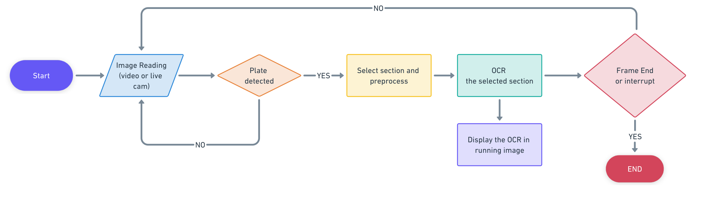

# Real-Time License Plate Recognition System

## Project Overview

This project implements a real-time license plate recognition system using computer vision and optical character recognition (OCR) techniques. The system processes video streams or live camera feeds to detect and read license plates automatically, utilizing quantized YOLO models for efficient object detection.

## Workflow

1. **Image Acquisition**: The system continuously reads frames from a video source or live camera.
2. **Plate Detection**: Each frame is analyzed using a quantized YOLO model to detect license plates.
3. **Preprocessing**: When a plate is detected, the relevant section of the image is selected and preprocessed.
4. **Optical Character Recognition (OCR)**: The preprocessed image section undergoes OCR to extract the license plate text.
5. **Display**: The recognized text is overlaid on the running video/image stream in real-time.
6. **Continuous Operation**: The system continues processing frames until manually stopped or interrupted.

## Features

- Real-time processing of video or live camera feeds
- Automatic license plate detection using quantized YOLO models
- Image preprocessing for improved OCR accuracy
- Text extraction using OCR
- Live display of recognized license plate numbers
- Efficient inference using ONNX Runtime

## Technologies Used

- YOLO (You Only Look Once) for object detection
- ONNX (Open Neural Network Exchange) for model interoperability
- ONNX Runtime for efficient model inference
- OpenCV for image processing
- Optical Character Recognition (OCR) library (Tesseract)
- Python for implementation

